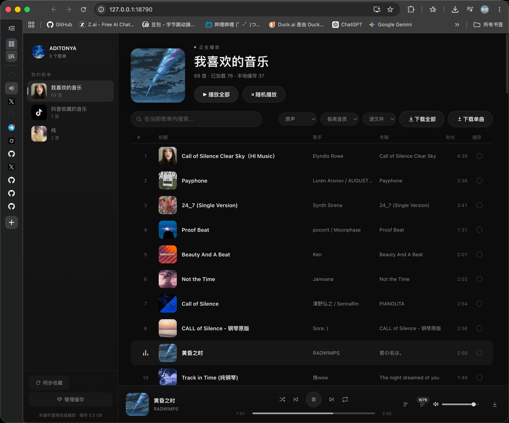

<div align="center">

# qsyy

**汽水音乐第三方 Web 播放器 · 全端可用**

浏览并播放你的汽水音乐收藏 · 本地缓存直读 · 在线播放 · 逐字歌词 · 音效 · 下载

[](https://github.com/shiaho777/qsyy/stargazers)
[](./app/LICENSE)
[](#全端支持)
[](#快速开始)

</div>

<p align="center">
  
</p>

---

## 核心功能

### 音效引擎:官方 DSP 链,浏览器实时渲染

qsyy 不做"模拟 EQ",而是**直接解析官方下发的音效配置,在浏览器里重建同一条 DSP 链**。官方 `track_v2` 接口随每首歌下发 `audio_effects` 配置(增益 / 参量 EQ / 动态压缩 / 声场展宽 / 卷积混响 / 前瞻限幅器),前端逐节点映射为 Web Audio 原生节点:

- 参量 EQ → `BiquadFilter` 链(LowShelf / Peaking / HighShelf,逐频段还原 Q 值与增益)
- 动态范围压缩 → `DynamicsCompressor`(阈值、拐点、比率、启动 / 释放时间全部按配置还原,含 makeup gain)
- 声场展宽 → 中 / 侧(M/S)矩阵拆分,side 通道按宽度系数增益后合回
- 卷积混响 → 按配置的 rt60 生成双声道脉冲响应,`ConvolverNode` 干湿比混合
- 前瞻限幅器 → 高比率压缩器保护输出不削波

两种用法:**智能音效**——汽水服务端为当前这首歌逐曲调校的配置,点开即用,和客户端听到的完全一致;**预置音效**——超重低音 / 清澈人声 / 现场 / 摇滚 / 黑胶 / 动感电音 / 360 环绕,官方同款目录,本地实时渲染。切歌时音效自动跟随(新歌不可用则自动关回原声),整条链热插拔不断流,加载失败自动回落原声并提示。

### 音质:从缓存到下载,逐曲可选

- **播放**:缓存扫描按音质优先级排序(无损 → Hi-Res → 空间音频 → 极高 → 高 → 标准),同曲多音质条目自动选最优;在线播放则从签名直链中按码率挑最高一档。
- **下载**:无损音质 / Hi-Res / 空间音频 / 极高音质 / 高音质 / 标准音质六档逐曲可选,与客户端音质体系一一对应;试听片段会自动识别并走在线通路拿完整版,避免 30 秒假无损。

### 下载与转码:源文件或任意格式

- **源文件**:直接 remux 客户端缓存或 CDN 流为 faststart M4A,`-c copy` 零转码,比特率与客户端完全一致,音质零损失。
- **转码**:ffmpeg 一条链完成格式转换与标签写入——M4A(AAC 256k)、MP3(320k)、FLAC、WAV、OGG(Vorbis q5),配合音质档位组合出目标文件。
- 批量下载当前列表、单曲下载、失败重试、输出目录一键打开。

### 缓存机制:三层设计,是本项目的核心

**第一层:客户端缓存直读。** 汽水客户端把已播歌曲缓存在 `LunaCacheV2`,qsyy 直接读它的索引库 `entries.db`(LMDB):按 `trackId` 定位缓存条目拿到 `chunkId`,校验 `.bin` 文件头(`ftyp` 盒)与尺寸后流式播放。多数条目是明文 M4A,可直接播;加密条目走 CENC 解密——解析 MP4 的 `senc` / `stsz` / `stco` / `stsc` 采样表,用客户端自带的 `device.node` 从 `spade_a` 密钥材料解出 AES-128 密钥,逐样本(含子样本明密文交错表)AES-128-CTR 解密,再 remux 回标准容器。整个过程只读客户端文件,不修改、不干扰客户端。

扫描的稳定性是专门处理过的:`entries.db` 会被客户端持续写入,直接打开可能失败,因此每次扫描都 fork 子进程对文件快照进行,10 秒 TTL 内的并发请求共享同一份快照,结果按 key 去重合并;子进程崩溃自动换新快照重试。列表页的批量状态查询按曲目 id 粒度缓存,翻页回访不再触发子进程。

**第二层:播放即缓存(增量库)。** 未缓存的歌曲在线播放时,边播边把 CDN 流落盘为 qsyy 自己的增量缓存:`.part` 分段写入、元数据按 400ms 节流落盘、中断后断点续传;下满即自动解密转正为 `.m4a`。下次播放秒开,不再回源。缓存库支持多套切换、曲目明细、按 trackId 清理、tar 一键备份与导入(流式解包,路径穿越安全)。

**第三层:双车道下载调度。** 所有下载(在线播放的自动缓存、批量缓存、手动下载)进入统一队列,总并发 2,分成两条车道:**播放专用道**保证用户刚点的歌永远不被批量任务饿死;**后台道**消化批量任务;排队的后台任务可随时升级到播放道。全新下载走 4 段并行分块(单连接 CDN 吞吐是瓶颈,分片通常缩短 3–4 倍等待),断点续传保持单流以兼容既有 `.part` 字节。

三层叠加的效果:**听过的歌零等待,没听过的歌边下边听,批量缓存不打断正在点的歌**。底部状态栏实时显示缓存总量,每首歌的缓存进度通过 SSE 推送(脏门控:空闲时零序列化、零推送)。

### 逐字歌词

官方 K 歌格式逐字还原:每行 `[startMs,durMs]` 后跟逐字时间标签,前端逐字渐变高亮、平滑滚动居中、点击任意字跳转;翻译行按毫秒与原文对齐同步显示。歌词随播放解析落盘,面板打开即毫秒级命中。

## 快速开始

**客户端安装**(推荐):从 [Releases](https://github.com/shiaho777/qsyy/releases/latest) 下载对应平台的安装包,每次发布均附带更新日志:

| 端 | 产物 |
|----|------|
| macOS | `qsyy-x.y.z-arm64.dmg` / `.zip` |
| Windows | `qsyy-setup-x.y.z.exe`(NSIS 安装器,由维护者构建附加到 Release) |
| Android | `qsyy-x.y.z.apk`,安装后填入桌面端局域网地址 |

桌面客户端内嵌同一服务端,开箱即用;Android 壳需先在电脑上启动服务端并开启
局域网访问(`QSYY_HOST=0.0.0.0`)。

**源码运行**:

```bash
git clone https://github.com/shiaho777/qsyy.git
cd qsyy

npm install --prefix app/bridge    # 安装依赖(含 lmdb 原生模块)
npm run standalone                 # → http://127.0.0.1:18790
```

打开浏览器访问 `http://127.0.0.1:18790`,登录态会自动从本机客户端读取,无需任何配置。

**环境要求**

| 依赖 | 说明 |
|------|------|
| Node.js 18+ | 服务端运行时 |
| ffmpeg | 可选,下载转码时使用(`brew install ffmpeg` / `winget install ffmpeg` / `apt install ffmpeg`) |
| 汽水音乐客户端 | 同机已安装并登录过一次(只读复用其会话与缓存) |

**常用环境变量**(全部可选,完整列表见[平台文档](./app/PLATFORM-macOS.md#环境变量))

| 变量 | 默认 | 说明 |
|------|------|------|
| `QSYY_PORT` | `18790` | 服务端口 |
| `QSYY_HOST` | `127.0.0.1` | 设为 `0.0.0.0` 开放局域网访问(手机 / 平板) |
| `QSYY_DOWNLOAD_DIR` | `~/Downloads/qsyy` | 下载输出目录 |
| `QSYY_CACHE_DIR` | 客户端缓存位置 | LunaCacheV2 缓存目录覆盖 |
| `FFMPEG_PATH` | 自动查找 | ffmpeg 可执行文件路径 |

## 快捷键

| 按键 | 功能 |
|------|------|
| `空格` | 播放 / 暂停 |
| `←` / `→` | 快退 / 快进 5 秒 |
| `↑` / `↓` | 音量 ±5% |

系统媒体键(播放 / 暂停 / 上一首 / 下一首 / 拖动进度)通过 MediaSession 全端可用;输入框聚焦时快捷键自动让位。

## 全端支持

qsyy 本质是一个 Web 应用——**任何有现代浏览器的设备都可以访问它**,手机 / 平板 / 电脑通用。服务端支持 macOS / Windows,自动定位客户端安装与缓存位置。

| 端 | 状态 |
|----|------|
| 浏览器(PWA) | 开箱即用,任何设备 |
| macOS | 客户端(dmg/zip)+ 服务端,缓存直读 + 在线播放 |
| Windows | 客户端(NSIS/zip)+ 服务端,缓存直读 + 在线播放 |
| Android | 客户端(apk)或浏览器 / PWA,移动端 UI + 在线播放 |

局域网访问(手机连同一 Wi-Fi):

```bash
QSYY_HOST=0.0.0.0 npm run standalone
# → [qsyy] LAN: http://192.168.x.x:18790
```

移动端为响应式 UI(≤720px 抽屉侧栏、紧凑播放条、触控目标加大),PWA 安装后获得独立全屏窗口;所有流式接口支持 Range,进度拖动在移动浏览器上表现一致。

## Roadmap

- [x] macOS 缓存直读 + 零登录在线播放
- [x] Windows 平台适配(客户端自动定位、Cookie 读取、签名库加载)
- [x] Android 移动端适配(响应式 UI、抽屉侧栏、PWA 安装、LAN 访问)
- [x] 三端客户端发版(macOS dmg / Windows NSIS / Android apk,tag 自动构建)
- [ ] 歌单导入 / 导出
- [ ] 更多音效与可视化

欢迎通过 Issue / PR 参与共建!

## 架构

```
┌──────────────────────────────────────────────────┐
│            浏览器 / PWA(全端,任何设备)             │
│    原生 JS 前端 · 虚拟化列表 · 逐字歌词 · Web Audio  │
└─────────────────────┬────────────────────────────┘
                      │ HTTP / SSE
┌─────────────────────▼────────────────────────────┐
│           standalone server(Node.js)             │
│  官方 API 代理 · 流式播放(Range)· 增量缓存 · 下载   │
├────────┬──────────────┬──────────────┬───────────┤
│ 签名子进程│  缓存扫描子进程 │   ffmpeg      │ 扫码登录   │
│(客户端   │ (LMDB 快照 +  │ (解密 remux / │(签名库缺失 │
│ 网络栈)  │  CENC 解密)   │  转码封装)    │  时兜底)   │
└────────┴──────────────┴──────────────┴───────────┘
```

一条歌曲请求的通路(`GET /api/stream/:id`):

```
本地缓存命中?──是──▶ 按需 CENC 解密(并发上限 2)──▶ 流式响应
      │否
      ▼
在线通路(ttnet 签名直链或扫码网页会话)
      │  后台同步下载为增量缓存(播放专用道,永不排队饿死)
      ▼
边下边播 + Range 随意拖动,下次秒开
```

在线直链由常驻签名子进程解析:按序加载客户端自带的 mssdk 签名库与 cronet 引擎,复用客户端网络栈调用 `track_v2`,以客户端登录态拿到签名 CDN 直链;子进程崩溃自愈,签名库缺失时自动降级扫码网页会话。认证、解密、歌词格式、HTTP API、性能设计的完整细节见 [app/PLATFORM-macOS.md](./app/PLATFORM-macOS.md)。

## Star History

[](https://star-history.com/#shiaho777/qsyy&Date)

## 许可证

[GPL-3.0 + 非商业附加条款](./app/LICENSE) · 本项目与汽水音乐官方无关,请支持正版音乐。
